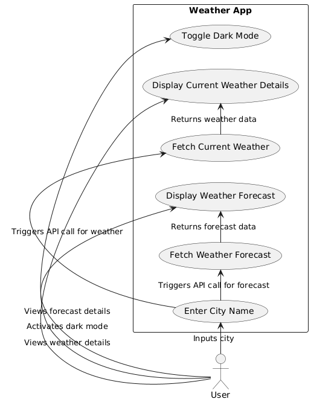
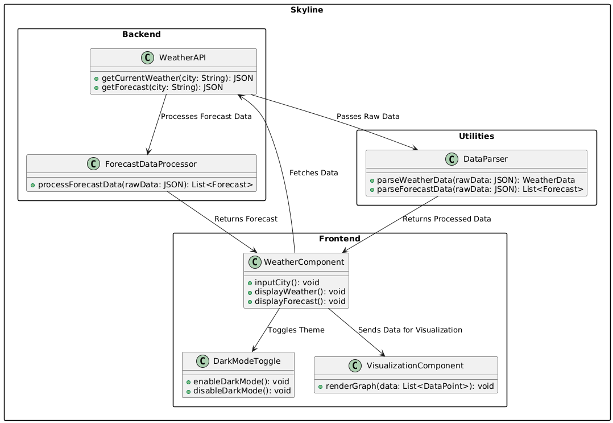
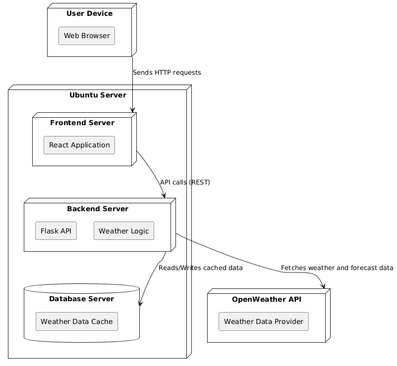

# Specification

## Étude des concurrents existants

### Concurrents existants

-**meteo-france :**

-Fonctionnalités : Prévisions détaillées sur plusieurs jours, alertes météorologiques, cartes interactives.
-Forces : Informations précises et officielles, interface en français.
-Faiblesses : Application un peu lente, navigation parfois complexe.
-**Accuweather:**

-Fonctionnalités : Prévisions horaires, radar interactif, alertes personnalisées.
-Forces : Très détaillé et fiable, interface moderne.
-Faiblesses : Publicités fréquentes, certaines fonctionnalités nécessitent un abonnement.

-**weather.com:**

-Fonctionnalités : Prévisions sur 10 jours, vidéos météo, informations sur les phénomènes climatiques.
-Forces : Plateforme internationale, large base de données.
-Faiblesses : Trop d'informations inutiles, publicités intrusives.

## Besoins fonctionnels

- **Recherche de ville :**:
  -Permettre à l'utilisateur de rechercher une ville par son nom.
  

- **Affichage des données météo actuelles :**:

  - Température actuelle.
  -Condition météorologique (ensoleillé, pluvieux, etc.).
  -Taux d'humidité.
  -Vitesse et direction du vent.
- **Affichage des prévisions météorologiques :**:
  - Prévisions sur plusieurs jours (minimum 5).
   -Visualisation des températures minimales et maximales.
   -Icônes représentant les conditions météo

- **Heure locale :**:
  - Affichage de l'heure locale en fonction du fuseau horaire de la ville sélectionnée.

- **Visualisation des données :**:
  - Graphiques pour les prévisions horaires (température, vitesse du vent, etc.).
  -Cartes interactives pour visualiser les conditions climatiques.
-**mode sombre**:
 -Basculer entre le mode clair et le mode sombre pour améliorer l'expérience utilisateur.

## Besoins non fonctionnels

- **UI/UX**:
  - nterface intuitive, adaptée aux écrans mobiles et desktop.
   -Design moderne et épuré.
   -Navigation rapide entre les différentes sections.
- **Performance**:
  - Chargement des données en moins de 2 secondes.
   -Optimisation pour les connexions Internet lentes.

### Technical Specifications

#### Backend

- **Framework**: Python Flask
  - API RESTful pour récupérer les données météo.
   -Intégration avec l'API OpenWeatherMap.

#### Frontend

- **Framework**: React.js
  - Affichage dynamique des données météorologiques.
  -Intégration de bibliothèques comme recharts pour les graphiques.

#### Database

- **PostgreSQL**
  -Stocker les recherches fréquentes pour améliorer les performances.

### Deployment

Linux Ubunto Server with:

- Python 12
- NodeJs 22 LTS
- PostgreSQL 17 Server